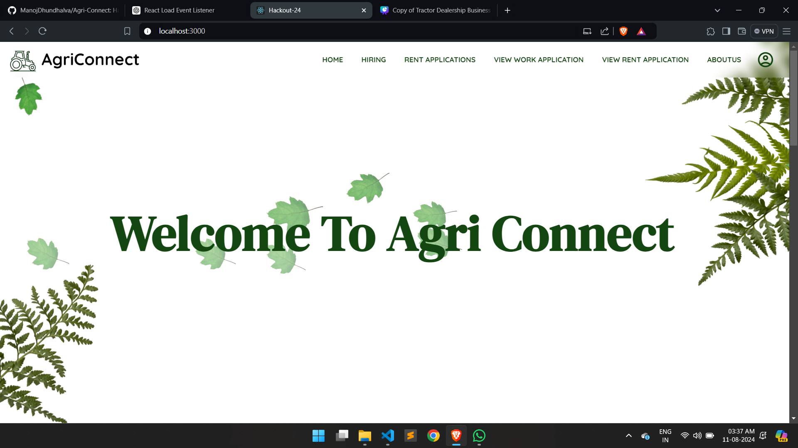

# AgriConnect

AgriConnect is a web application designed to revolutionize agricultural technology by connecting farmers with workers and providing a platform for renting agricultural machinery. Built on the MERN stack, AgriConnect leverages modern web technologies to offer a seamless experience for farmers and workers alike.

## Table of Contents

- [AgriConnect](#agriconnect)
  - [Table of Contents](#table-of-contents)
  - [Features](#features)
  - [Technology Stack](#technology-stack)
  - [Installation](#installation)
  - [Usage](#usage)
  - [Screenshots](#screenshots)
  - [Deployed Website](#deployed-website)
  - [License](#license)

## Features

- **Hire Workers**: Farmers can post applications to hire workers for specific agricultural tasks. Workers nearby can view the applications, check the rating of the hirer, and send proposals to work.
  
- **Rate & Review**: Both farmers and workers can rate each other after the completion of the work, enhancing future recommendations and helping to maintain a high standard of service.

- **Rent Machinery**: Farmers with adequate machinery can rent it out through the platform. Others in need of machinery can book it based on availability, managing units and freeing them up after use.

- **User Profiles**: Detailed profiles for both farmers and workers, showcasing ratings, past work, and machinery owned or rented.

- **Job Management**: Farmers can manage their job postings, view proposals from workers, and accept or reject proposals based on worker profiles and ratings.

## Technology Stack

- **Frontend**: React, Bootstrap, MaterialUI, CSS, JavaScript
- **Backend**: Node.js, Express.js
- **Database**: MongoDB
- **Deployment**: Vercel

## Installation

1. Clone the repository:
   ```bash
   git clone https://github.com/yourusername/AgriConnect.git
   cd AgriConnect
   ```

2. Install dependencies:
   ```bash
   npm install
   ```

3. Set up environment variables:
   - Create a `.env` file in the root directory.
   - Add the following variables:
     ```
     MONGO_URI=your_mongo_uri
     FRONTEND_URL=http://localhost:3000
     ```

4. Start the development server:
   ```bash
   npm run dev
   ```

## Usage

1. **Signup/Login**: Users can sign up or log in to the platform using their email and password.
    
2. **Create Job Posting**: Farmers can create job postings by providing details about the work, including the type of work, location, and the number of workers required.
    
3. **Search and Apply for Jobs**: Workers can search for available jobs, view details, and send proposals to work.
    
4. **Rent Machinery**: Farmers can list their machinery for rent, specifying the quantity available. Others can book the machinery as needed.
    
5. **Manage Jobs and Machinery**: Users can manage their job postings and machinery rentals, including updating or deleting them as needed.
    
## Screenshots

1. **Home Page**  
   

2. **Login/Signup Page**  
   

3. **Profile Page**  
   

3. **Add Machinery**  
   

4. **Rent Machinery Page**  
   

5. **Manage Machinery Page**  
   

6. **Create Job Application Page**  
   

7. **Search Jobs Page**  
   

8. **Manage Created Jobs Page**  
   

9. **Mail service**  
   

10. **About Us Page**  
   
    
## Deployed Website

Check out the live version of AgriConnect: [agri-connect-blitz.vercel.app](https://agri-connect-blitz.vercel.app)

## License

This project is licensed under the Blitz License.